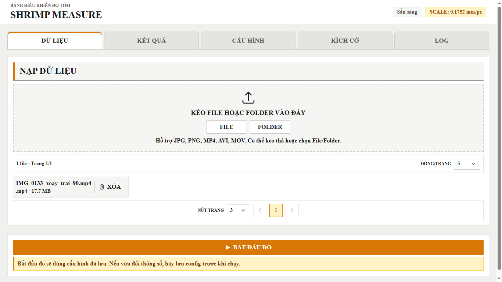
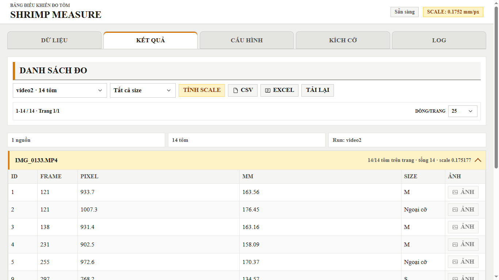
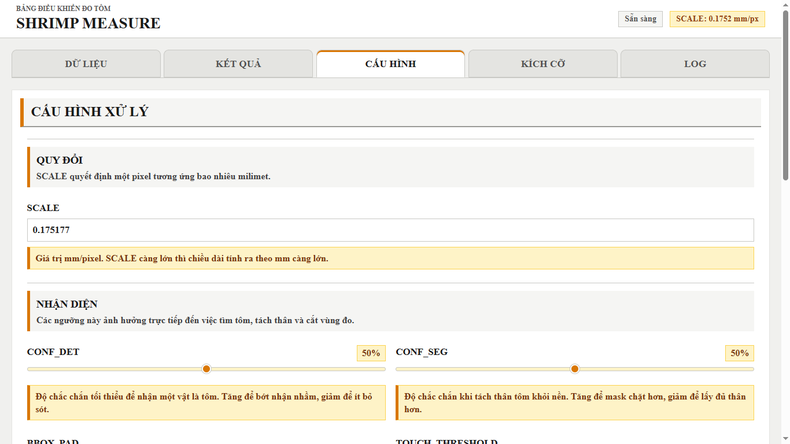
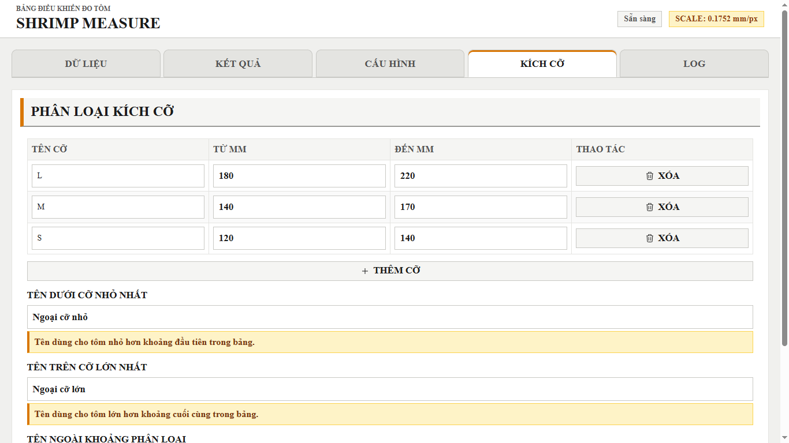
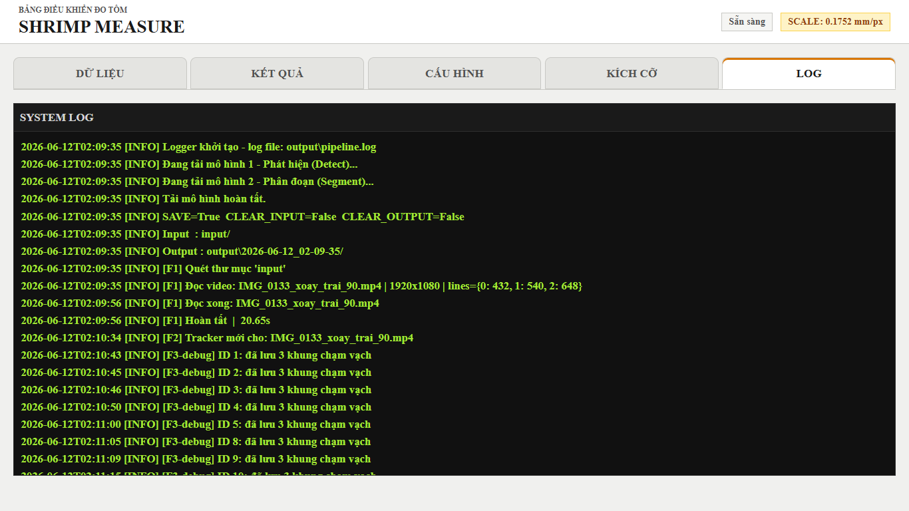

# Shrimp Measure

Ứng dụng Flask hỗ trợ đo chiều dài tôm từ ảnh hoặc video. Hệ thống dùng mô hình phát hiện và phân đoạn để tách từng con tôm, đo chiều dài theo pixel, quy đổi sang milimét bằng hệ số `SCALE`, rồi phân loại kích cỡ.

## Giao diện và chức năng

Các ảnh dưới đây được chụp toàn màn hình trực tiếp từ ứng dụng đang chạy trên trình duyệt.

### 1. Dữ liệu



Tab **Dữ liệu** dùng để kéo-thả hoặc chọn file/thư mục đầu vào. Ứng dụng hỗ trợ `JPG`, `PNG`, `MP4`, `AVI`, `MOV`; hiển thị danh sách file, cho phép phân trang và xoá file đã nạp. Nút **Bắt đầu đo** khởi chạy pipeline với cấu hình đã lưu.

### 2. Kết quả



Tab **Kết quả** hiển thị số đo từng con tôm theo lần chạy, gồm frame, chiều dài pixel, chiều dài quy đổi theo mm và kích cỡ. Người dùng có thể lọc theo size, xem ảnh kết quả/debug, hiệu chuẩn `SCALE`, tải lại dữ liệu và xuất báo cáo ở định dạng CSV hoặc Excel.

### 3. Cấu hình



Tab **Cấu hình** dùng để điều chỉnh hệ số quy đổi `SCALE`, ngưỡng phát hiện (`CONF_DET`), ngưỡng phân đoạn (`CONF_SEG`), phần đệm vùng đo (`BBOX_PAD`), ngưỡng chạm vạch và các tham số xử lý video. Tab cũng cung cấp tuỳ chọn thư mục input/output, lưu ảnh debug, dọn dữ liệu đầu vào và kết quả cũ.

### 4. Kích cỡ



Tab **Kích cỡ** cho phép tạo, sửa hoặc xoá các khoảng phân loại chiều dài (mm), ví dụ S, M và L. Ngoài ra có thể đặt nhãn cho tôm dưới cỡ, trên cỡ hoặc nằm ngoài các khoảng đã khai báo.

### 5. Log



Tab **Log** theo dõi nhật ký của pipeline: thời điểm tải model, nguồn dữ liệu, tiến trình xử lý video/ảnh, thông tin phát hiện và lỗi nếu có. Đây là nơi hỗ trợ kiểm tra nguyên nhân khi kết quả chưa như mong muốn.

## Yêu cầu

- Python 3.10 trở lên.
- GPU Intel và OpenVINO là cấu hình mặc định trong dự án (`DEVICE = "intel:gpu"`). Có thể cần điều chỉnh thiết bị trong `config.py` cho phù hợp với máy sử dụng.
- Các model đã được đặt trong thư mục `model/`.

## Cài đặt dependencies

Tạo môi trường ảo (khuyến nghị):

```powershell
python -m venv .venv
.\.venv\Scripts\Activate.ps1
```

Cài các thư viện cần thiết:

```powershell
python -m pip install --upgrade pip
pip install -r requirements.txt
```

## Chạy ứng dụng Flask

Tại thư mục gốc của dự án, chạy:

```powershell
python app.py
```

Sau đó mở trình duyệt tại [http://127.0.0.1:3000](http://127.0.0.1:3000).

Quy trình cơ bản: nạp ảnh/video ở tab **Dữ liệu** → (tuỳ chọn) lưu cấu hình ở tab **Cấu hình** → nhấn **Bắt đầu đo** → xem, lọc hoặc xuất dữ liệu tại tab **Kết quả**.

## Báo cáo đồ án

Báo cáo PDF đi kèm dự án: [64131212_MaiNgocHoangLong_9d.pdf](64131212_MaiNgocHoangLong_9d.pdf).

## Cấu trúc chính

- `app.py`: giao diện web Flask và các API.
- `main.py`, `pipeline.py`: luồng suy luận, đo chiều dài và sinh kết quả.
- `model/`: model YOLO/OpenVINO.
- `input/`, `output/`: dữ liệu đầu vào và kết quả xử lý.
- `settings.json`: cấu hình và khoảng kích cỡ hiện tại.
- `image/`: ảnh minh hoạ sử dụng trong README.
